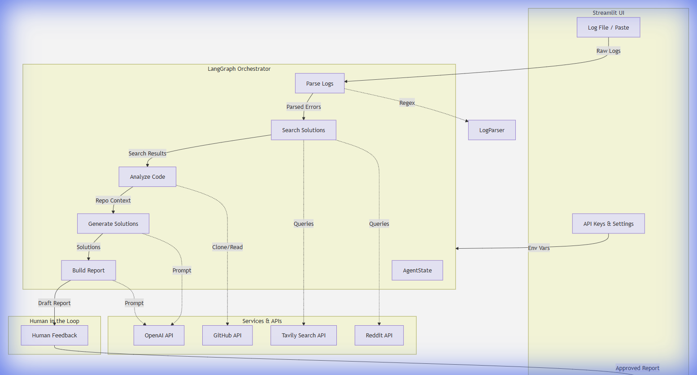

# Log Analysis Agent Architecture

This document outlines the architecture of the Log Analysis Agent, a Streamlit-based application that uses LangGraph to orchestrate a multi-step log analysis workflow.

## 1. High-Level Overview

The application follows a linear pipeline architecture orchestrated by LangGraph. It takes raw log files and optional context (GitHub repo) as input, passes them through a series of analysis nodes, and produces a structured report as output.

```mermaid
graph TD
    subgraph Frontend [Streamlit UI]
        UI[app.py]
        Input[Log File / Paste]
        Config[API Keys & Settings]
        Results[Dashboard & Reports]
    end

    subgraph Agent_Core [LangGraph Orchestrator]
        State[AgentState]
        
        N1[Parse Logs]
        N2[Search Solutions]
        N3[Analyze Code]
        N4[Generate Solutions]
        N5[Build Report]
    end

    subgraph Human_Review [Human in the Loop]
        HF[Human Feedback]
    end

    subgraph External_Services [Services & APIs]
        OpenAI[OpenAI API]
        Tavily[Tavily Search API]
        GitHub[GitHub API]
        Reddit[Reddit API]
    end

    %% Flow
    Input -->|Raw Logs| N1
    Config -->|Env Vars| Agent_Core

    %% Process Flow
    N1 -->|Parsed Errors| N2
    N2 -->|Search Results| N3
    N3 -->|Repo Context| N4
    N4 -->|Solutions| N5
    N5 -->|Draft Report| HF
    HF -->|Approved Report| Results

    %% Service Integrations
    N1 -.->|Regex| Utils[LogParser]
    N2 -.->|Queries| Tavily
    N2 -.->|Queries| Reddit
    N3 -.->|Clone/Read| GitHub
    N4 -.->|Prompt| OpenAI
    N5 -.->|Prompt| OpenAI
```mermaid
graph TD
    ...
```


## 2. Component Details

### Frontend (Streamlit)
*   **File**: `app.py`
*   **Role**: Handles user interaction, state management for the session, and data visualization.
*   **Inputs**: Log files (.log, .txt), GitHub Repository URL, API Keys.
*   **Outputs**: Interactive dashboard (metrics, badges), Downloadable reports (Markdown, JSON).

### Agent Core (LangGraph)
*   **Graph Definition**: `agent/graph.py` defines the state machine.
*   **State (`AgentState`)**: A typed dictionary shared across all nodes containing:
    *   `logs`: Raw string content.
    *   `parsed_errors`: List of dicts (lines, messages, severity).
    *   `search_results`: Context from web searches.
    *   `code_analysis`: Snippets from GitHub.
    *   `solutions`: AI-generated fixes.
    *   `final_report`: The compilation.

### Nodes (`agent/nodes.py`)
1.  **Parse Logs**: Uses `utils.parsers.LogParser` to identify errors/warnings using Regex patterns.
2.  **Search Solutions**: Queries Reddit and Stack Overflow (via Tavily) for the top 5 error messages.
3.  **Analyze Code**: Clones the provided GitHub repo, searches for files containing error keywords, and extracts snippets.
4.  **Generate Solutions**: Prompts OpenAI (GPT-4o-mini) to synthesize findings into actionable solutions.
5.  **Build Report**: Prompts OpenAI to format the final Markdown report.
6.  **Human Feedback**: Helper node (interrupt) to allow user review before finalization.

### Utilities & Tools
*   **LogParser** (`utils/parsers.py`): Contains RegEx patterns for standard logs (Time, Level, Message, Stack trace).
*   **ExternalTools** (`agent/tools.py`):
    *   `search_reddit`: Uses Reddit API (PRAW or similar).
    *   `search_stackoverflow`: `tavily-python` client.
    *   `analyze_github_repo`: `gitpython` for cloning and file traversal.

## 3. Data Flow

1.  **Ingestion**: User provides logs via UI.
2.  **Parsing**: Logs are broken down into structured error objects.
3.  **Enrichment**:
    *   **External**: Web search adds context to error messages.
    *   **Internal**: Repository analysis links errors to source code files.
4.  **Synthesis**: LLM combines errors + web context + code context to generate solutions.
5.  **Reporting**: Final report is generated and displayed back to the user.
